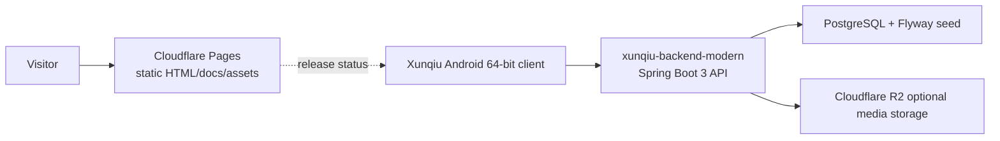

# Xunqiu Showcase Site | 寻球技术展示站

一个面向访客和开发者的纯静态展示站，用来说明寻球移动端重建、现代后端迁移、短视频上传链路和 APK 正式发布门禁。

简体中文文档：[README.zh-CN.md](README.zh-CN.md)


## Contents

- [Preview](#preview)
- [Why This Exists](#why-this-exists)
- [Features](#features)
- [Architecture](#architecture)
- [Quick Start](#quick-start)
- [Deployment](#deployment)
- [Project Structure](#project-structure)
- [Testing](#testing)
- [Release And APK Boundary](#release-and-apk-boundary)
- [Security](#security)
- [Roadmap](#roadmap)
- [License](#license)

## Preview

Public-safe assets included in this repository:

- `assets/football-hero.jpg` for the first viewport.
- `assets/video-cover-street.jpg` and `assets/video-cover-passing.jpg` for the video pipeline section.
- APK artifacts remain in the maintainer's local release archive and are not included in this public repository before formal release approval.

Open `index.html` to view the product case page, and open `docs.html` for technical documentation entry points.

## Why This Exists

Xunqiu started as a legacy football community app with old Android tooling, 32-bit native dependencies, media upload paths, and a Java web backend. This repository does not contain the old app or backend. It packages the public presentation layer so visitors can understand:

- what the old system looked like technically;
- why the 64-bit Android client was rebuilt as a lighter path;
- how the Spring Boot backend restores the core API envelope;
- how images and short videos move through upload, storage, list return, and playback;
- where the APK release gate and backend verification boundaries are.

## Features

- Static product page with BIAU Port / 泊岸 branding.
- Technical docs for legacy Android analysis, Android 64-bit rebuild, video pipeline, and deployment validation.
- Public-safe visual assets and no runtime build step.
- Cloudflare Pages `_headers` for public-safe static asset caching.
- A visible APK release status that does not expose unapproved stage artifacts.

## Architecture



This repository owns only the public `pages` boundary. Android artifacts and the backend are maintained separately.

## Quick Start

No Node.js, Python, or build tool is required.

```powershell
cd xunqiu-showcase-site
Start-Process .\index.html
Start-Process .\docs.html
```

If you prefer a local HTTP server:

```powershell
python -m http.server 4173
```

Then open `http://localhost:4173/`.

## Deployment

Cloudflare Pages settings:

| Field | Value |
| --- | --- |
| Framework preset | `None` |
| Build command | leave empty |
| Build output directory | `/` or repository root |
| Root directory | repository root |
| Environment variables | none required |

The site is intentionally static. Do not add backend secrets, Render variables, R2 credentials, signing files, or database connection strings to this repository.

## Project Structure

```text
.
├── index.html
├── docs.html
├── favicon.svg
├── _headers
├── assets/
├── docs/
│   └── technical/
```

## Testing

Recommended local checks before publishing:

```powershell
Test-Path .\index.html
Test-Path .\docs.html
if (Test-Path .\downloads\*.apk) { throw 'Unapproved APK found in public showcase repository.' }
rg -n "sk-|DATABASE_URL|R2_SECRET|PRIVATE KEY|BEGIN RSA|BEGIN OPENSSH" .
git diff --check
```

For link and asset review, open `index.html` and `docs.html` in a browser and confirm the release-status section contains no direct APK link.

## Release And APK Boundary

Stage APK artifacts are kept outside this public repository. Public download remains disabled until the candidate has:

- an approved release signing process;
- a published SHA-256 and version/changelog;
- scan and regression evidence;
- rollback notes and maintainer approval.

Before publishing a future APK, record the source build, feature scope, timestamp, SHA-256, and validation result in the companion Android project, then update the showcase through a reviewed release change.

## Security

- This repository must not contain production credentials, private backend URLs, model keys, database URLs, R2 keys, signing material, or local machine paths.
- Do not add APK/AAB files or public download links until signing and release approval are complete.
- Cloudflare Pages only serves static files. Dynamic API behavior belongs to the backend service.

## Roadmap

- Add a release manifest beside the APK with version, SHA-256, build source, and validation notes.
- Add screenshots from the Android 64-bit client once they are public-safe and current.
- Add a small static link checker for docs/assets/downloads.
- Keep the showcase content aligned with the backend README and BIAU Port project detail page.

## License

This repository is licensed under the [Apache License 2.0](LICENSE).
