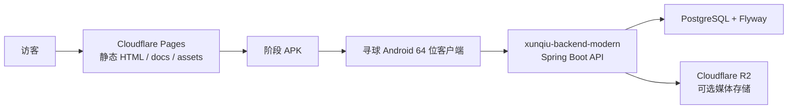

# 寻球技术展示站

中文文档 | [English README](README.md)

这是一个面向访客和开发者的纯静态展示站，用来说明寻球移动端重建、现代后端迁移、短视频上传链路和阶段 APK 演示边界。

## 功能

- 纯静态 HTML/CSS 展示页，无构建步骤。
- 首页展示寻球移动端重建、技术路线和演示入口。
- 技术文档页整理旧 Android 分析、64 位重建、视频链路和部署验证。
- `_headers` 配置 APK content type 与静态资源缓存。
- `downloads/latest-xunqiu64.apk` 仅作为阶段演示包，不是官方发布包。

## 架构



该仓库只负责静态展示站和阶段 APK 静态托管边界。Android 项目和后端项目单独维护。

## 快速开始

不需要 Node.js、Python 或其他构建工具。

可以直接双击打开 `index.html` 和 `docs.html`。也可以启动本地 HTTP 服务：

```bash
python -m http.server 4173
```

然后打开：

```text
http://localhost:4173/
```

## 部署

推荐 Cloudflare Pages：

| 字段 | 值 |
| --- | --- |
| Framework preset | `None` |
| Build command | 留空 |
| Build output directory | `/` 或仓库根目录 |
| Root directory | 仓库根目录 |
| Environment variables | 无需配置 |

不要把后端密钥、Render 环境变量、R2 凭据、签名文件或数据库连接串放进这个静态仓库。

## APK 边界

`downloads/latest-xunqiu64.apk` 是阶段/demo artifact：

- 可用于受控演示和手动安装测试；
- 不是正式签名发布包；
- 不是应用商店分发包；
- 后续公开发布需要签名策略、SHA-256、变更记录和人工批准。

## 检查

```bash
test -f index.html
test -f docs.html
test -f downloads/latest-xunqiu64.apk
rg -n "sk-|DATABASE_URL|R2_SECRET|PRIVATE KEY|BEGIN RSA|BEGIN OPENSSH" .
git diff --check
```

## 安全边界

- 不提交生产凭据、私有后端 URL、模型 key、数据库 URL、R2 key、签名材料或本机路径。
- 阶段 APK 不能被包装成官方发布包。
- 动态 API 行为属于后端服务，不属于静态站仓库。

## 许可证

当前仓库还没有独立许可证文件。正式作为可复用开源项目推广前，需要选择并添加许可证。
